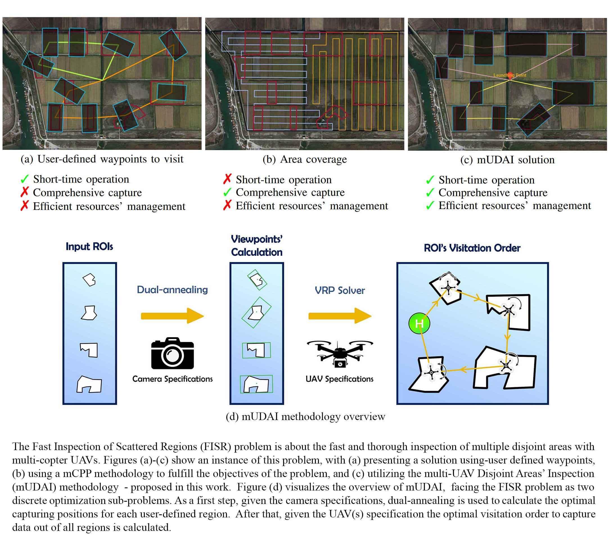
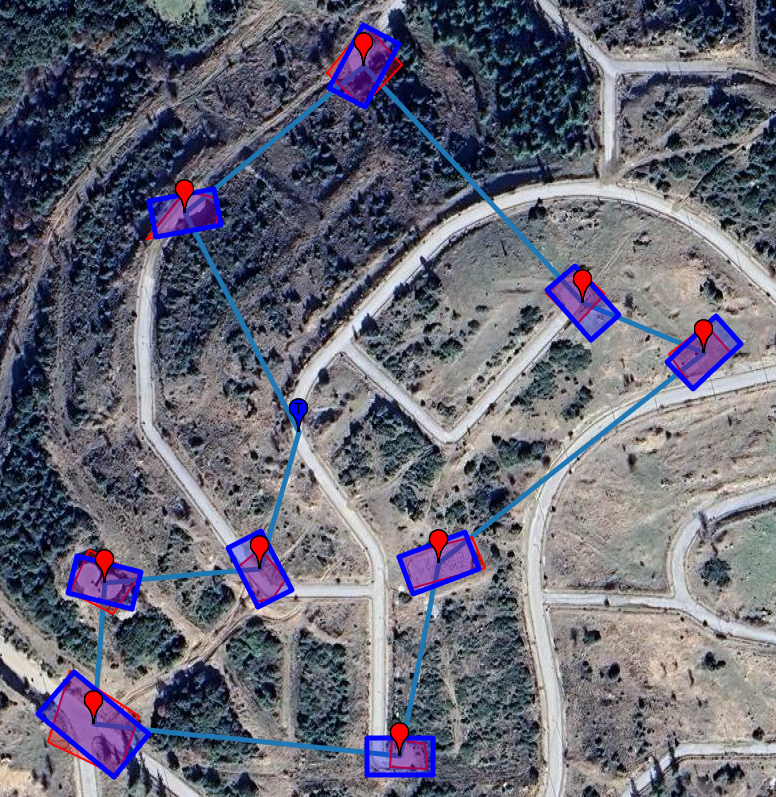

# Multi-UAV Disjoint Areas Inspection: An Effective and Efficient Solution to the Fast Inspection of Scattered Regions Problem


## Installation

1. **Clone the repository:**
   ```bash
   git clone https://github.com/username/my-project.git
   cd mudai
2. **Create your environment:**
   ```bash
   conda env create -f environment.yml
   conda activate mudai
3. **Run the application:**

   To run the script with the default GeoJSON file:
   ```bash
   python run.py
   ```
   To specify a different GeoJSON file, use the -filename flag:
   ```bash
   python run.py -filename path/to/your/geojson_file.json
   ```
   If you wish to provide an output file name for saving the results (optional):
   ```bash
   python run.py -filename path/to/your/geojson_file.json -outputname path/to/output.json
  

## GeoJSON Structure

The GeoJSON file for this project encapsulates both spatial information and operational parameters for UAV missions. The file is divided into several key sections:

### 1. Polygons

- **Purpose:** Defines regions of interest that the UAV must cover during its mission.
- **Structure:** An array of polygons, where each polygon is an array of coordinate objects.
- **Coordinate Object:**
  - lat: Latitude (in decimal degrees)
  - long: Longitude (in decimal degrees)

**Example:**

```bash
"polygons": [
  [
    { "lat": 40.58271230427383, "long": 23.08611574318444 },
    { "lat": 40.582797860357818, "long": 23.08652354843265 },
    { "lat": 40.58292544640078, "long": 23.08645381099826 },
    { "lat": 40.58284396457393, "long": 23.086062099004143 }
  ],
  [
    { "lat": 40.58481268032198, "long": 23.08567874010903 },
    { "lat": 40.58467416506565, "long": 23.08586529048298 },
    { "lat": 40.58484783609579, "long": 23.086079867204174 },
    { "lat": 40.58501079476798, "long": 23.085882587994165 }
  ]
  // ... additional polygons
]
```
### 2. Initial Positions

- **Purpose:** Specifies the UAV’s starting location (optional).
- **Structure:** A single coordinate object.
- **Coordinate Object:**
  - lat: Latitude (in decimal degrees)
  - long: Longitude (in decimal degrees)
    
**Example:**
```bash
"initialPos": {
  "lat": 40.583349968125407,
  "long": 23.08552615440468
}
```
### 3. Camera Specifications
- **Purpose:** Defines the UAV camera’s field-of-view (FOV) specifications.
- **Structure:** Contains horizontal and vertical FOV values.
```bash
"cameraSpecs": {
  "hFOV": 73.7,
  "vFOV": 45.7
}
```
### 4. Operational Parameters
  **batteryDuration**: Duration (in minutes) that the UAV can operate.
    
  **flightAltitude**: Desired transient flight altitude (in meters).
  
 **max_altitude** & **min_altitude**: Upper and lower flight altitude limits.
 
  **vertical_speed** & **horizontal_speed**: Movement speeds (in meters per second).
  
  **num_vehicles**: Number of available UAVs for deployment.
  
  **multi_uav**: A boolean indicating whether multiple UAVs will operate **simultaneously**. If `true`, each UAV is           assigned a distinct transient altitude to prevent collisions. If `false`, UAVs execute their missions one after         another in sequence.
  
  **iou_metric**: Boolean flag to use the Intersection over Union (IoU) metric (BCO metric from paper). If its           `false`, then MCO metric will be used.
  
  **hCoeff** & **vCoeff**: Coefficients for horizontal and vertical distances to calculate the maximum operational       distance/time.
  
  **safety_factor**: A scaling factor used in flight planning to adjust the maximum operational distance/time based on environmental conditions. Under ideal conditions, it can be set close to 1, whereas in challenging conditions, such as strong winds, it should be reduced accordingly to ensure safe and efficient operation.

**For a full example, please refer to the sample files in the `geojson` folder.**

## Visualization
The code generates a mission.json which we give as an input to our UAV and a visualization.json which can be used to visualize the mission's paths and the camera captures for each polygon/parcel.
To generate a gmplot with the output json simply run
`python visualize_fov.py`.
For the current example.json, this command generates the picture below:


## ChoosePath online platform  

The **ChoosePath** platform is an online tool for multi-UAV mission planning, designed for **inspection operations**. It integrates **Coverage Path Planning (CPP)** for coverage tasks and the **mUDAI** algorithm for the **Fast Inspection of Scattered Regions (FISR)**.  

This repository provides an **open-source Python implementation** of the mUDAI algorithm, offering full customization for advanced users. However, if you prefer a more user-friendly interface, you can also use the **ChoosePath platform** to **generate and visualize flights** using mUDAI, though with fewer customization options compared to this GitHub implementation.  

🔗 **Explore the ChoosePath Platform**: [ChoosePath Platform](https://sites.google.com/view/mudai-platform/)  

